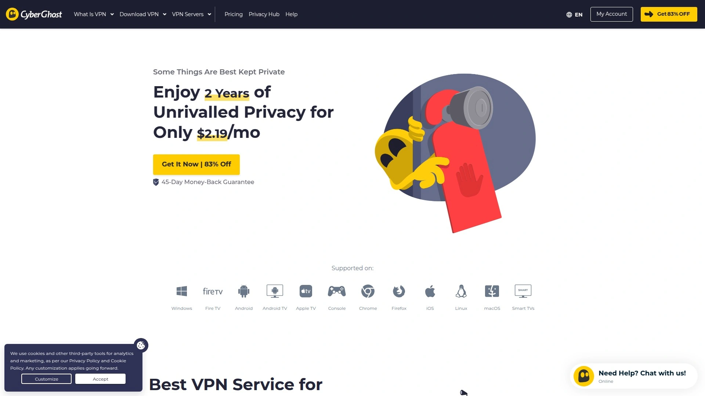
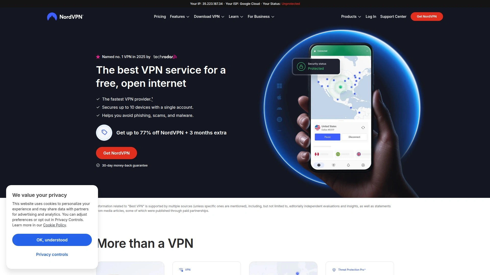
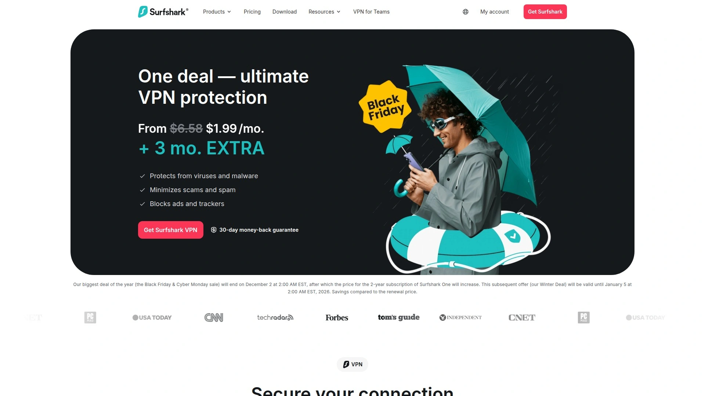
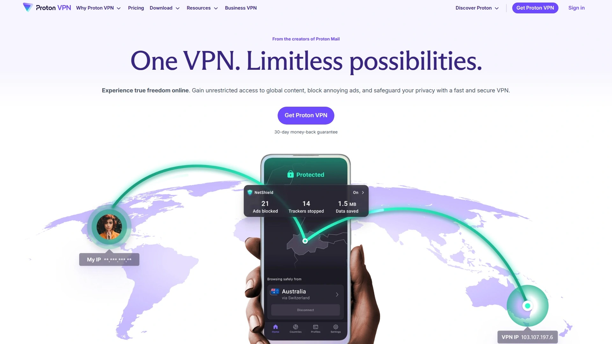
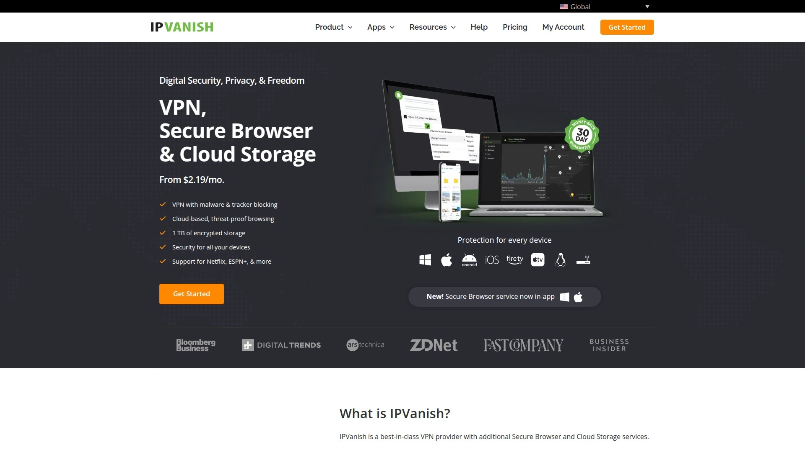

# Latest VPN Service Overview (Including Speed Comparisons)

Internet service providers throttle bandwidth during peak hours, government surveillance tracks browsing patterns across borders, and hackers snoop on public WiFi networks stealing passwords within seconds. VPN services encrypt online traffic, mask IP addresses, and route connections through secure global server networks protecting privacy whether streaming content, torrenting files, or simply browsing from coffee shops. This overview examines eight premium providers delivering fast speeds, robust security protocols, and reliable access to geo-restricted content without compromising connection stability or user experience.

## **[CyberGhost VPN](https://cyberghostvpn.com)**

Extensive server network with 45-day money-back guarantee and task-specific connections.

CyberGhost operates one of the largest VPN server fleets globally, providing access across 100 countries with specialized servers optimized for streaming, gaming, and torrenting. Task-specific server categories simplify connection choices—streaming servers unblock Netflix, Disney+, and HBO Max reliably, while gaming servers minimize latency for competitive online play. The service completed third-party audits confirming its no-logs policy and security implementations.

Romania headquarters position CyberGhost outside Five Eyes, Nine Eyes, and Fourteen Eyes surveillance alliances, providing strong privacy protections through favorable jurisdiction. Quarterly transparency reports detail government data requests, warrant canaries, and compliance obligations demonstrating accountability beyond competitor standards. Seven simultaneous device connections protect entire households through one subscription.

Built-in ad blocker eliminates intrusive advertisements and tracking scripts without requiring separate browser extensions. Windows users receive antivirus protection bundled with VPN subscriptions. Router configuration guides enable protecting Smart TVs, game consoles, Amazon Fire TV sticks, Android TV boxes, and Apple TV devices lacking native VPN support.

**Pricing structure:** Monthly plans cost $12.99, six-month subscriptions run $6.99 monthly, and the 26-month plan drops to $2.19 per month—representing 83% savings over monthly rates. Extended plans include 45-day money-back guarantees versus 14 days for monthly subscriptions. Customer support operates 24/7 via live chat and email responding in multiple languages.

## **[NordVPN](https://nordvpn.com)**

Industry-leading speeds with proprietary NordLynx protocol and specialty server options.

NordVPN consistently tops speed benchmarks through its proprietary NordLynx protocol built on WireGuard foundations, delivering blazing-fast connections even across transcontinental distances. The service operates 8,200+ servers across 120+ countries supporting 10 simultaneous device connections. Annual third-party audits verify the strict no-logs policy with public result publications.

Specialty servers provide advanced functionality beyond standard VPN connections. Double VPN routes traffic through two servers simultaneously for enhanced privacy, Onion over VPN automatically connects through Tor for maximum anonymity, and obfuscated servers hide VPN usage from restrictive networks blocking VPN traffic. P2P-optimized servers handle torrenting efficiently, while dedicated IP addresses eliminate CAPTCHA challenges from shared server usage.

Meshnet feature connects personal devices remotely using home IP addresses from anywhere, bypassing streaming service password-sharing restrictions. Threat Protection blocks malicious websites, removes ads and trackers, and scans downloads for malware. Smart DNS functionality enables VPN usage on devices lacking native app support.

NordWhisper protocol provides lightweight security for highly restrictive environments where standard protocols fail. Post-quantum encryption prepares defenses against future quantum computing threats before such technology becomes viable. Performance tests show minimal speed reduction during active connections—some users report faster downloads than baseline speeds.

**Best for:** Users prioritizing maximum speeds, comprehensive specialty features, and independently audited security over cost considerations.

## **[Surfshark](https://surfshark.com)**

Unlimited simultaneous connections with innovative Alternative ID and Camouflage Mode features.

Surfshark eliminates device limits entirely, protecting unlimited smartphones, tablets, computers, and smart TVs through single subscriptions costing significantly less than competitors. This makes Surfshark ideal for large households, families sharing accounts, or individuals owning numerous connected devices. The service operates 3,200+ RAM-based servers across 100 countries ensuring data wipes occur automatically with each reboot.

Alternative ID generates fake personal details including names, addresses, birthdates, and email addresses for online registrations requiring personal information. This innovative feature protects real identity during account creations without resorting to burner services. Built-in antivirus protects devices real-time from malware, scams, and dangerous websites. Surfshark Search provides private, ad-free searching showing organic results without tracking or personalized ads.

Camouflage Mode disguises VPN traffic as regular HTTPS connections preventing ISPs from detecting VPN usage and potential throttling. NoBorders Mode enables secure access even on networks imposing strict VPN restrictions. Dynamic MultiHop routes connections through multiple server combinations selected dynamically based on security needs.

Netherlands jurisdiction within Nine Eyes alliance poses theoretical data sharing risks, though the no-logs policy mitigates exposure. Recent audits confirmed Surfshark stores IP addresses during active sessions but deletes them within 15 minutes after disconnection. WireGuard and OpenVPN protocol options provide speed versus security trade-offs.

## **[ExpressVPN](https://www.expressvpn.com)**

Premium service with proprietary Lightway protocol audited three times by KPMG.

ExpressVPN commands premium pricing justified through streamlined apps, exceptional speeds, and rigorous security audits. The proprietary Lightway protocol uses open-source WolfSSL cryptography completing three independent KPMG audits validating implementation security. Servers span 105 countries supporting diverse geographic requirements.

Post-quantum encryption implementation protects against advanced hacking methods before quantum computers become practical threats. TrustedServer technology runs entirely on RAM-based infrastructure automatically wiping all data with each reboot, physically preventing persistent logs. MediaStreamer Smart DNS extends VPN benefits to gaming consoles, Smart TVs, and streaming devices lacking native app support.

Five simultaneous device connections seem limited compared to competitors offering 10 or unlimited connections. Split tunneling selects which applications route through VPN versus direct connections, optimizing bandwidth usage. Network Lock kill switch prevents traffic leaks if VPN connections drop unexpectedly.

British Virgin Islands jurisdiction provides strong privacy protections outside major surveillance alliances. Customer support operates 24/7 via live chat with knowledgeable representatives resolving issues quickly. Thirty-day money-back guarantee allows risk-free testing.

**Consideration:** Monthly subscriptions cost $12.95, annual plans run $8.32 monthly—premium pricing reflecting advanced features and extensive auditing.

## **[Proton VPN](https://protonvpn.com)**

Swiss-based provider offering the best free VPN tier and Secure Core architecture.

Proton VPN delivers the industry's best free VPN subscription providing unlimited bandwidth, access to servers across three countries, single device protection, and medium speeds without data caps. This exceptional free tier lets users test capabilities indefinitely before upgrading. The Switzerland headquarters ensures strong privacy laws independent from surveillance alliances.

Secure Core architecture routes traffic through privacy-friendly countries before exiting to final destinations, protecting against compromised servers in high-risk jurisdictions. This unique defense mitigates timing/correlation attacks that other VPNs cannot prevent. Servers in Iceland, Switzerland, and Sweden handle initial connections before forwarding to worldwide exit points.

Open-source apps enable public code inspection verifying security implementations. Perfect Forward Secrecy generates new encryption keys for each session preventing decryption even if future keys compromise. NetShield blocks ads, trackers, and malware without separate extensions. WireGuard with ChaCha20 cipher provides fast secure connections.

Proton VPN integrates with Proton Mail and Proton Drive creating comprehensive privacy ecosystem. Free accounts access these services building substantial value beyond VPN functionality. Paid plans add higher speeds, more server locations, VPN Accelerator boosting speeds up to 400%, and streaming support.

## **[Private Internet Access](https://www.privateinternetaccess.com)**

Budget-friendly veteran with court-proven no-logs policy and unlimited device support.

Private Internet Access proved its no-logs policy twice in court when authorities subpoenaed user data but PIA provided nothing because no logs existed. This legal validation exceeds third-party audits, demonstrating actual commitment rather than theoretical promises. Founded in 2010, PIA operates as industry veteran understanding VPN privacy fundamentals.

Unlimited simultaneous device connections protect entire households without restrictions. Open-source transparency allows anyone inspecting or modifying VPN protocols for complete verification. Per-network settings automatically enable VPN connections when rejoining unsecured WiFi networks. Kill switch blocks internet access if VPN fails preventing accidental data exposure.

Server network spans 91 countries with 84 locations offering strong geographic diversity. Email breach monitor checks whether email addresses appeared in security breaches. MACE feature blocks ads, trackers, and malware system-wide. Split tunneling routes selected apps through VPN while others connect directly.

Recent Kape Technologies acquisition concerned some users given Kape's history developing potentially unwanted programs under the Crossrider name. However, PIA maintained independent operations, continuing court-proven privacy practices. Monthly plans cost $11.95, annual subscriptions drop to $3.33 monthly, and three-year plans reach $2.03 per month—exceptional value for features provided.

## **[TunnelBear VPN](https://www.tunnelbear.com)**

Approachable bear-themed interface with free data-limited tier and annual independent audits.

TunnelBear disguises serious privacy capabilities behind playful bear-themed interfaces making VPN technology approachable for first-time users. Annual independent audits confirm security practices and no-logs policies. The friendly design reduces intimidation factors preventing less technical users from adopting VPN protection.

Free tier provides 2GB monthly data allowing genuine testing before purchasing subscriptions. This generous free option suits light users checking email, browsing occasionally, or testing VPN functionality without financial commitment. Unlimited simultaneous connections protect all devices once upgrading to paid plans.

GhostBear obfuscation makes VPN traffic appear as regular internet activity bypassing VPN detection and blocking. VigilantBear kill switch prevents unprotected connections if VPN drops. SplitBear tunneling chooses which apps route through VPN.

Servers operate across 49 countries—smaller networks than competitors but sufficient for most geographic needs. Customer support lacks live chat relying entirely on email tickets, which frustrates users needing immediate assistance. The approachable interface and strong privacy stance make TunnelBear excellent for VPN newcomers despite fewer servers.

## **[IPVanish VPN](https://www.ipvanish.com)**

Truly unlimited device connections with extensive US server coverage.

IPVanish removes all device limits allowing protection for dozens of smartphones, tablets, computers, Smart TVs, and IoT devices through single subscriptions. This genuine unlimited support exceeds competitors capping connections at 10 or fewer devices. Families with extensive smart home ecosystems benefit significantly from unrestricted protection.

Server network emphasizes US coverage providing numerous domestic connection points alongside international options. SOCKS5 proxy support accelerates P2P torrenting by eliminating encryption overhead while maintaining IP masking. WireGuard, OpenVPN, and IKEv2 protocol options accommodate various security and speed requirements.

Apps support Windows, macOS, iOS, Android, Amazon Fire TV, Android TV, Roku, Linux, and routers covering comprehensive platform needs. Split tunneling routes selected traffic through VPN while other apps connect directly. Automatic kill switch prevents data leaks during connection failures.

Monthly subscriptions cost $12.99, annual plans drop to $3.33 per month, and two-year subscriptions reach $2.19 monthly. No free trial tests services before purchasing, though 30-day money-back guarantees reduce risk. Expensive monthly pricing makes long-term commitments more economical.

## FAQ

**Do VPN services actually slow down internet speeds significantly?**

Premium VPNs like NordVPN, CyberGhost, and ExpressVPN typically reduce speeds by only 3-8% during testing, maintaining fast enough connections for 4K streaming and large file downloads. Budget services or overloaded servers cause more noticeable slowdowns exceeding 20-30% reductions. Choose servers geographically close to your location minimizing distance-related latency, and select WireGuard protocol over OpenVPN when speed matters most. Test multiple server locations finding optimal performance for your specific network conditions.

**Can I use VPNs to access streaming services blocked in my country?**

CyberGhost provides dedicated streaming servers specifically optimized for unblocking Netflix, Disney+, HBO Max, BBC iPlayer, and other geo-restricted platforms. NordVPN's SmartPlay feature automatically selects best servers for streaming without manual configuration. Surfshark and ExpressVPN reliably bypass VPN detection on major streaming platforms. However, streaming services actively block known VPN IP addresses, so connection success varies by provider and server—premium services update IP addresses faster maintaining consistent access.

**Are free VPN services safe enough for everyday browsing?**

Proton VPN offers the only genuinely safe free tier providing unlimited bandwidth, strong encryption, no-logs policy, and Swiss privacy jurisdiction without selling user data. Most free VPNs monetize through selling browsing data to advertisers, injecting tracking cookies, or serving targeted advertisements compromising the privacy VPNs should protect. TunnelBear's limited 2GB free tier provides safe testing but insufficient for regular use. Avoid completely free services from unknown providers—premium VPNs cost $2-3 monthly through long-term subscriptions, worthwhile investments for genuine privacy.

## Secure Your Digital Privacy Immediately

These eight VPN services eliminate surveillance risks, geo-restrictions, and bandwidth throttling through military-grade encryption, global server networks, and proven no-logs policies verified by independent audits or court proceedings. [CyberGhost VPN](https://cyberghostvpn.com) particularly suits users wanting extensive server options with task-specific connections for streaming, gaming, and torrenting, backed by 45-day money-back guarantees, quarterly transparency reports, and Romanian jurisdiction outside surveillance alliances—all at budget-friendly $2.19 monthly through long-term commitments. Select based on your priorities whether unlimited device connections, court-proven privacy, proprietary security protocols, or generous free tiers, and your encrypted protection activates within minutes of downloading apps.
